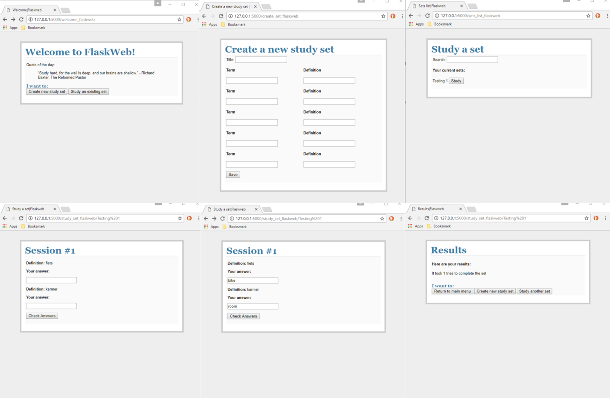

# A Study Website created with Flask

Basic Programming Project <br />
Authors: @creoco & @thediligentcow <br />
Cognitive Science and Artificial Intelligence, Class of 2021, Tilburg University <br />
Instructors: Dr. F. Hermens and E. van Miltenburg <br />

Special thanks to our friend Geoffrey Westhoff for teaching us the ways of the jinja(2); Khoa Phan for his suggestion of using Flask in the first place; the team behind Quizlet for creating such an amazing website that has saved us in our final exams, which in turn inspired us to start this project; and @bev-a-tron for creating such a doable tutorial to begin with Flask - the style for this app is heavily adapted from her style_lulu.css. Thanks also to our classmates - Alexsandra, Codrin, Seda, Aidan, Gökçe and Sanna who volunteered to test our app and gave us helpful feedback, especially Codrin for letting us invade his laptop in the middle of the night and almost destroy its operating system. <br />

## INTRODUCTION
This app creates a website that allows users to create basic study sets that are made up of terms and definitions (maximum 5 couples at a time), and stores them in the library root as separate .txt files. These files can be manipulated by using the search and study functions incorporated in the app. As for the study function, the app will load the study set of the user's choice, show them the definitions and ask them for their corresponding terms. This process will repeat until every question is correctly answered. The study results - the number of trials - will be shown in the result page. <br />



## REQUIREMENTS
The app was programmed in Python version: 3.6.4 using PyCharm 3.4 as IDE <br />
Other required libraries are specified in requirements.txt, which can be installed by: <br />
```
pip install -r requirements.txt
```
An appropriate virtual environment needs to be configured depending on which IDE is in use. <br />
For some IDE, like PyCharm, an appropriate virtual environment(venv) needs to be installed in order to run the app. <br />
In python 3 the venv package is included, but in every release before Python 3.4 the user has to download the venv package first.<br />
The user can run venv in command prompt using this: <br />
```
python3 -m venv venv
```

## HOW TO USE
1. Make sure to download and upzip all of the files in your library root, ensure the directory of the Flask app looks similar to this: <br />
```bash
├── _images
|   ├── interface.png
├── _static
|   ├── style_flaskweb.css
├── _templates
|   ├── create_set_flaskweb.html
|   ├── flashing_layout_flaskweb.html
|   ├── results_flaskweb.htm
|   ├── sets_list_flaskweb.html
|   ├── study_set_flaskweb.html
|   ├── study_set_flaskweb_retry.html
|   ├── welcome_flaskweb.html
├── .gitignore
├── README.md
├── application_flaskweb.py
├── quotes_flaskweb.txt
├── requirements.txt
```

2. If needed, configure your app intepreter, as well as a virtual environment as instructed above. Also make sure to install all of the required libraries, most importantly Flask. <br />
```
pip install flask
```

3. Run the application_flaskweb.py from your command prompt (cmd) (typing 'cmd' in your operating system search) as below. Once the app is running, open your web browser and type in the local host (normally is http://127.0.0.1:5000/) <br />
```
(source) {{ directory to your python.exe }} {{ directory to the application_flaskweb.py }}
```
For example:
```
C:\User\Admin C:\python\python.exe C:\Users\Admin\python\StudyingWeb-withFlask-master\application_flaskweb.py
```


Alternatively, you can open the application_flaskweb.py on your Python interpreter and run it as you normally would. The testing period shows that the app should run flawlessly on PyCharm, but for Spyder with Anaconda, there are a few things that need to be taken care of. <br />

**Note for Spyder and Anaconda users:** <br />
Since it seems that Spyder does not keep up with the newest version of Flask (1.0.2), the app needs to be run from command prompt. Still, the "quote of the day" on Welcome page will not run properly using this way, so delete that part inside the welcome_page function inside application_flaskweb.py. Save this change and use command prompt to run the app. <br />

A better solution will be: "You need to edit the echo function definition at ../site-packages/click/utils.py. The default value for the file parameter must be sys.stdout instead of None. Do the same for the secho function definition at ../site-packages/click/termui.py" <br />
-josechval (https://github.com/plotly/dash/issues/257#issuecomment-391185831) <br />

If this still doesn't work, another solution is to downgrade flask to version 0.12.2 <br />
-Domanic (https://github.com/plotly/dash/issues/257#issuecomment-391187891) <br />

**Other important note:** <br />
An error "OSError: [Errno 48] Address already in use" or "socket.error: [Errno 48] Address already in use" may arise using cmd, if a connection using the same command for a website was previously opened. "To prevent this from happening in the first place, simply **press Ctrl+C** to quit in terminal while SimpleHTTPServer is still running normally." <br />
- Mark Chapel. <br />
Otherwise, you need to "kill" the host in order to allow the app to run, or change the default port 5000 to something else (5001 for example) in cmd. Further on this problem, please check: https://stackoverflow.com/questions/19071512/socket-error-errno-48-address-already-in-use/19071568#19071568, and https://stackoverflow.com/questions/48205495/python-how-to-run-multiple-flask-apps-from-same-client-machine <br />  


## REFERENCE
Flask documentations: http://flask.pocoo.org/docs/1.0/ <br />
Jinja documentations: http://jinja.pocoo.org/docs/2.10/ <br />
HTML guidelines: https://www.w3schools.com/html/default.asp <br />
MyFlaskTutorial: https://github.com/bev-a-tron/MyFlaskTutorial <br />
Project ideas: https://quizlet.com/ <br />
Other specific sources are included in the comment part of the app's script. <br />
